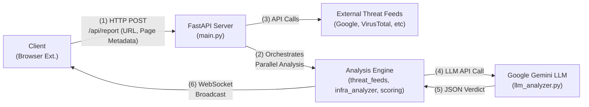

# Project Documentation: Theft Alert - Advanced Phishing & Fraud Detection System

**Version:** 1.0.0
**Last Updated:** 2026-08-12

## 1. Executive Summary

### 1.1. Project Mission

Theft Alert is a server-side, real-time security analysis engine designed to protect end-users from web-based threats such as phishing, fraud, malware distribution, and credential theft. It serves as the intelligent backend for a client-side application (e.g., a browser extension), providing rapid and accurate risk assessments of visited URLs.

### 1.2. Core Problem Solved

Modern web threats are increasingly sophisticated, often bypassing traditional blocklist-based security. Phishers use newly registered domains, valid SSL certificates, and clever social engineering to appear legitimate. Theft Alert addresses this by moving beyond simple reputation checks to perform a holistic, multi-layered analysis that incorporates infrastructure forensics, heuristic pattern matching, and AI-powered contextual understanding.

### 1.3. Key Differentiators

*   **Multi-Layered Analysis:** Aggregates signals from dozens of sources across three distinct layers: external threat intelligence, infrastructure analysis, and content heuristics.
*   **AI-Powered Judgment:** Utilizes a Large Language Model (Google Gemini) to act as a virtual security analyst, identifying nuanced and novel threats that automated checks might miss.
*   **Real-Time Prevention:** Delivers verdicts to the client via WebSockets, enabling immediate user notification and preventing interaction with malicious sites before compromise.
*   **Comprehensive Data Model:** Collects a rich set of telemetry from the client, including page text, form structures, and resource links, to fuel its analysis.

---

## 2. System Architecture

### 2.1. High-Level Architecture Diagram (Conceptual)



### 2.2. Component Breakdown

*   **Client (Browser Extension):** The data originator. It captures the URL, page content, and other metadata upon navigation and sends it to the backend. It also maintains a WebSocket connection to receive real-time results.
*   **Backend Server (FastAPI):** The central orchestrator, written in Python. It exposes the API, manages WebSocket connections, and executes the analysis pipeline.
*   **Analysis Engine:** A collection of Python modules responsible for the core logic:
    *   `threat_feeds.py`: Queries external threat intelligence APIs.
    *   `infra_analyzer.py`: Performs forensic checks on the site's infrastructure (WHOIS, SSL).
    *   `llm_analyzer.py`: Prepares data for and queries the LLM, and includes a heuristic fallback.
    *   `scoring.py`: Aggregates all results into a final, weighted score.
*   **External Services:** Third-party APIs that provide threat intelligence data. These are crucial for the reputation analysis layer.
*   **Large Language Model (LLM):** Google Gemini is used for the final layer of contextual analysis, providing a human-like judgment on the collected evidence.

### 2.3. Technology Stack

*   **Backend Framework:** FastAPI
*   **Web Server:** Uvicorn (ASGI)
*   **Language:** Python 3.9+
*   **Real-time Communication:** WebSockets
*   **HTTP Client:** `httpx` (for asynchronous API calls)
*   **Core Libraries:** `pydantic`, `python-whois`, `dnspython`
*   **Configuration:** `python-dotenv`

---

## 3. Detailed Workflow: The Request Lifecycle

1.  **Client-Side Ingestion:** A user navigates to a URL. The browser extension collects a JSON payload containing `url`, `domain`, `title`, `cleanText`, `forms`, `links`, `iframes`, and other metadata.

2.  **API Request:** The extension sends an HTTP `POST` request with the JSON payload to the `/api/report` endpoint on the FastAPI server.

3.  **Backend Orchestration (`main.py`):**
    *   The `report_url` function receives the request.
    *   The full payload is logged to `scan_reports.log` for auditing and future training.
    *   It initiates two primary analysis tasks concurrently using `asyncio.gather`.

4.  **Parallel Analysis Execution:**
    *   **Task A: Reputation Checks (`run_all_reputation_checks` in `threat_feeds.py`):**
        *   An `httpx.AsyncClient` is created.
        *   A list of coroutines, one for each threat feed (e.g., `check_google_safe_browsing`, `check_virustotal`), is created.
        *   `asyncio.gather` executes all these API calls in parallel, significantly reducing I/O wait time.
    *   **Task B: Infrastructure Checks (`run_infra_checks` in `infra_analyzer.py`):**
        *   Runs `get_ssl_details`, `get_whois_detailed`, and other infrastructure checks concurrently.
        *   Simultaneously runs `heuristic_url_analysis` on the URL and page content.

5.  **Data Aggregation for LLM (`main.py` -> `llm_analyzer.py`):**
    *   The results from both tasks are collected.
    *   A new, comprehensive `llm_scan_report` dictionary is created, combining the original client payload with the results of all reputation and infrastructure checks.
    *   The `analyze_scan_report` function is called.

6.  **AI-Powered Judgment (`llm_analyzer.py`):**
    *   If a `GEMINI_API_KEY` is present, the `_build_scan_summary` function transforms the massive `llm_scan_report` into a condensed, token-efficient summary.
    *   This summary is embedded in a prompt that instructs the Gemini model to act as a security analyst and return a structured JSON object matching `RESPONSE_SCHEMA`.
    *   An API call is made to the Gemini API.
    *   **Fallback:** If the Gemini API call fails or the key is missing, the system falls back to the `_heuristic_result` function, which calculates a risk score based on a simpler set of rules.

7.  **Final Analysis & Normalization (`llm_analyzer.py`):**
    *   The `_normalize_result` function takes the raw output from either Gemini or the heuristic fallback.
    *   It cleans, validates, and standardizes the result, ensuring a consistent output format.
    *   Crucially, it implements a **safety override**: if Google Safe Browsing reported a confirmed threat, the final `risk_score` is floored at a high value (e.g., 95), even if the LLM provided a lower score.

8.  **Real-time Broadcast (`main.py`):**
    *   The final, normalized analysis JSON is serialized into a string.
    *   The `manager.broadcast` function sends this string over the active WebSocket connection to all connected clients.
    *   The browser extension receives the message, parses it, and displays the appropriate UI (e.g., a warning banner).

9.  **Final Logging (`main.py`):**
    *   A detailed summary of the entire analysis, including the raw check results, the Gemini response, and the final verdict, is logged to `analysis_results.log`. This file is the primary source for debugging and future ML model training.

---

## 4. Feature Deep Dive

### 4.1. Layer 1: Reputation Analysis (`threat_feeds.py`)

This module aggregates data from multiple industry-standard threat intelligence feeds. Each check is an `async` function that returns a standardized dictionary.

| Source                      | Check Target(s) | Key Function                  | Notes                                                              |
| --------------------------- | --------------- | ----------------------------- | ------------------------------------------------------------------ |
| **Google Safe Browsing**    | URL             | `check_google_safe_browsing`  | Core check for known phishing/malware. High weight (10).           |
| **VirusTotal**              | URL             | `check_virustotal`            | Aggregator of 90+ scanners. High weight (9). Handles unscanned URLs. |
| **URLhaus (abuse.ch)**      | URL             | `check_urlhaus`               | Specializes in malware distribution URLs. High weight (9).         |
| **OpenPhish**               | URL, Domain     | `check_openphish`             | Free, community-driven phishing feed. Medium weight (7).           |
| **AbuseIPDB**               | IP Address      | `check_abuseipdb`             | Checks IP reputation based on abuse reports. Medium weight (7).    |
| **AlienVault OTX**          | Domain, IP      | `check_otx`                   | Community threat pulses. Medium weight (6).                        |
| **Spamhaus**                | Domain, IP      | `check_spamhaus`              | DNSBL check against spam/phishing lists. Medium weight (6).        |
| **Pulsedive**               | URL, Domain, IP | `check_pulsedive`             | Threat enrichment platform. Lower weight (5).                      |
| **URLScan.io**              | URL, Domain     | `check_urlscan`               | Forensic analysis of page renders. Medium weight (7).              |
| **crt.sh (CT Logs)**        | Domain          | `check_crtsh`                 | Certificate Transparency logs. Low weight (3), signals newness.    |

### 4.2. Layer 2: Infrastructure & Heuristic Analysis (`infra_analyzer.py`)

This module inspects the "physical" and structural properties of a website.

*   **SSL/TLS Certificate Analysis (`get_ssl_details`):**
    *   **Checks:** Expiration date, issuer, self-signed status, and subject/hostname match.
    *   **Red Flags:** Expired, self-signed, or expiring-soon certificates are assigned a high risk score. A mismatch between the certificate's Common Name (CN) and the domain is also a strong suspicious signal.

*   **WHOIS / Domain Registration Analysis (`get_whois_detailed`):**
    *   **Checks:** Domain creation date, expiration date, registrar, and use of privacy services.
    *   **Red Flags:** Extremely new domains (e.g., < 30 days old) are a primary indicator of phishing and receive a very high risk score. Short registration periods (e.g., 1 year) and the use of privacy protection on a new domain also increase risk.

*   **Heuristic & Content Analysis (`heuristic_url_analysis`):**
    *   **URL Structure:** Looks for `@` symbols, IP addresses in the hostname, punycode (`xn--`), excessive hyphens, and suspicious TLDs (`.xyz`, `.tk`).
    *   **Brand Impersonation:** Detects if a brand keyword (e.g., "paypal") is in the URL but the domain is not an official one.
    *   **Content (from client payload):**
        *   **Forms:** Detects password fields and forms that submit data to an external domain.
        *   **Text:** Scans for social engineering "urgency" keywords ("verify," "suspended," "action required").
        *   **Title/Domain Mismatch:** Checks if the page title mentions a brand that is not in the domain name (e.g., title "Microsoft Login" on domain `secure-support-123.com`).

### 4.3. Layer 3: AI Contextual Analysis (`llm_analyzer.py`)

This is the system's most advanced layer, providing nuanced judgment.

*   **Role of the LLM:** The Gemini model is prompted to act as a "careful phishing and fraud detection analyst." It is not just a text summarizer; it is a decision-making component.
*   **Input:** It receives a highly condensed but comprehensive summary of all data collected in the previous layers, including client-side text, form details, and all reputation/infra check results.
*   **Prompt Engineering:**
    *   **`SYSTEM_PROMPT`:** Sets the persona and core instructions (be concise, evidence-led, conservative, return JSON).
    *   **`RESPONSE_SCHEMA`:** Enforces a strict JSON output format, making the response machine-readable and predictable.
*   **Decision Logic:** The LLM excels at connecting disparate, weak signals. For example, it can reason that a `(new domain)` + `(Let's Encrypt SSL)` + `(password form)` + `(text containing "verify your account")` is a classic phishing pattern, even if no single signal is definitive.
*   **Heuristic Fallback (`_heuristic_result`):** Provides resilience. If the LLM is unavailable, a rule-based scoring system is used as a backup, ensuring the service never completely fails.

### 4.4. Final Scoring Engine (`scoring.py`)

This module is currently used for the `/api/scan_url` endpoint but its logic is a blueprint for a more advanced final aggregation step.

*   **Weighted Average:** Calculates a baseline score by averaging the `risk_score` of all checks, weighted by their `weight` and `confidence`.
*   **Critical Hit Boosting:** If a high-confidence "MALICIOUS" verdict comes from a critical source (Google, VT, URLhaus), the final score is automatically boosted to a minimum high-risk value (e.g., 85 or 95). This ensures that a single, strong negative signal is not diluted by many neutral or safe signals.
*   **Threat Categorization:** Determines the final `threat_type` (e.g., `PHISHING`, `MALWARE`) based on the final score and the nature of the detected threats.

---

## 5. Data Management & Privacy

This section outlines the data handling policies that **must** be clearly communicated to end-users in a Privacy Policy.

### 5.1. Data Collection Description

When a scan is initiated by the client application, the following data is collected and transmitted to the Theft Alert backend:

*   **URL & Domain Information:** The full URL and domain name of the page being analyzed.
*   **Page Content & Metadata:** Page title, a sanitized text version of the page content, and metadata about the scan trigger (e.g., `on_page_load`).
*   **Structural Page Data:** A structured representation of all forms (including input types), links, and iframes present on the page.
*   **Public Internet Data:** During analysis, our server retrieves publicly available information related to the URL, including its IP address, WHOIS registration data, and SSL certificate details.

**We do not collect or store any personally identifiable information (PII), user account details, cookies, or browsing history.**

### 5.2. Data Usage Declaration

*   **Primary Purpose:** All collected data is used **exclusively** for the purpose of security analysis to identify and protect you from malicious websites.
*   **Service Improvement:** Anonymized and aggregated analysis results are stored in our server logs (`analysis_results.log`). This data is vital for:
    *   Debugging and improving the accuracy of our detection algorithms.
    *   Training future machine learning models to detect new threats more effectively.
*   **No Commercial Use:** Your data is **never** sold, rented, or shared with third parties for advertising, marketing, or any other commercial purpose.

### 5.3. Third-Party Data Sharing

To perform the analysis, we share the **minimum necessary information** (typically the URL, domain, and/or IP address) with the following trusted third-party security services:

*   Google Safe Browsing
*   VirusTotal
*   URLhaus (abuse.ch)
*   OpenPhish
*   AbuseIPDB
*   AlienVault OTX
*   Spamhaus
*   Pulsedive
*   URLScan.io
*   crt.sh
*   Google (for the Gemini LLM analysis)

Our sharing of data with these providers is governed by their respective privacy policies.

---

## 6. Technical Specifications

### 6.1. Server Requirements

*   **Runtime:** Python 3.9+
*   **OS:** Linux (recommended)
*   **Dependencies:** See `requirements.txt`. Key packages include `fastapi`, `uvicorn`, `httpx`, `python-whois`, `dnspython`, `python-dotenv`, `google-generativeai`.
*   **Execution:** The server is launched using an ASGI server like Uvicorn:
    ```bash
    uvicorn main:app --host 0.0.0.0 --port 8000 --reload
    ```

### 6.2. Environment Configuration (`.env`)

The server requires a `.env` file in the `/backend` directory to store API keys and other secrets. The `get_api_key` function in `threat_feeds.py` is flexible, but using these primary names is recommended:

```ini
# .env file

# Core Services
GEMINI_API_KEY="AIzaSy..."
GOOGLE_API_KEY="AIzaSy..." # For Google Safe Browsing
VIRUSTOTAL_API_KEY="..."

# Secondary Threat Feeds
URLSCAN_API_KEY="..."
URLHAUS_API_KEY="..." # Auth-Key from abuse.ch
OTX_API_KEY="..." # AlienVault OTX
PULSEDIVE_API_KEY="..."
ABUSEIPDB_API_KEY="..."
SPAMHAUS_API_KEY="..." # Optional, for DQS
```

### 6.3. API Endpoint Specification

**Base URL:** `http://<server_ip>:8000`

---
#### `GET /`
*   **Description:** Health check endpoint.
*   **Response (200 OK):**
    ```json
    {"status": "online", "service": "Theft Alert API"}
    ```

---
#### `POST /api/report`
*   **Description:** The primary endpoint for the client extension. Receives a full page report, triggers the complete analysis pipeline (including LLM), and broadcasts the result via WebSocket.
*   **Request Body:** A complex JSON object sent by the extension.
    ```json
    {
      "url": "http://example-phishing.com/login",
      "domain": "example-phishing.com",
      "title": "Secure Login - My Bank",
      "reportType": "full_page_scan",
      "scanTrigger": "on_page_load",
      "cleanText": "Welcome, please enter your username and password to continue...",
      "forms": [{"action": "/submit", "inputs": [{"type": "password"}]}],
      "links": ["http://external-site.com"],
      "iframes": [],
      "resources": {"scripts": ["/main.js"]}
    }
    ```
*   **Response (200 OK):** A confirmation. The full analysis is sent via WebSocket.
    ```json
    {
      "message": "Report received, logged, analyzed, and broadcasted.",
      "domain": "example-phishing.com",
      "analysis": { /* ... full analysis object ... */ }
    }
    ```

---
#### `POST /api/scan_url`
*   **Description:** A public-facing endpoint to scan a URL without requiring a client-side payload. Runs all reputation and infrastructure checks and returns a scored summary.
*   **Request Body:**
    ```json
    {"url": "http://example-phishing.com"}
    ```
*   **Response (200 OK):** A detailed report including an overall verdict and a breakdown of all checks.
    ```json
    {
        "url": "https://example-phishing.com",
        "domain": "example-phishing.com",
        "ip": "93.184.216.34",
        "overall": {
            "risk_score": 95.0,
            "threat_type": "PHISHING",
            "brief_reason": "...",
            "recommendation": "⛔ DO NOT ENTER ANY CREDENTIALS..."
        },
        "reputation_checks": [/* ... */],
        "infrastructure_checks": [/* ... */]
    }
    ```

---
#### `POST /api/manual_report`
*   **Description:** Allows a user to manually flag a URL as suspicious.
*   **Request Body:**
    ```json
    {"url": "http://new-suspicious-site.com"}
    ```
*   **Response (200 OK):**
    ```json
    {"message": "Site reported successfully. Thank you for your contribution!"}
    ```

---
### 6.4. WebSocket Specification

*   **Endpoint:** `ws://<server_ip>:8000/ws/{client_id}`
*   **`client_id`:** A unique identifier generated by the client to distinguish its session.
*   **Lifecycle:**
    1.  The client connects to the endpoint upon initialization.
    2.  The server accepts and adds the connection to its pool of `active_connections`.
    3.  The client remains connected, listening for messages.
    4.  When an analysis is complete for *any* client, the `/api/report` endpoint calls `manager.broadcast`, which sends the final JSON analysis result to **all** connected clients.
    5.  The client-side logic should parse the incoming message and check if the `url` in the message matches the user's current tab URL before displaying a notification.
    6.  The connection is terminated when the user closes their browser or on network error (`WebSocketDisconnect`).

### 6.5. Logging Specification

Three distinct log files are generated in the `/backend` directory for auditing and analysis:

*   **`scan_reports.log`:**
    *   **Content:** Raw, full JSON payloads as received from the client at the `/api/report` endpoint.
    *   **Purpose:** Primary source for replaying events, debugging client-side data collection, and as a raw dataset for future feature engineering.

*   **`manual_reports.log`:**
    *   **Content:** A simple text log of URLs manually reported by users via `/api/manual_report`.
    *   **Purpose:** Community-sourced threat intelligence. Can be periodically reviewed to identify threats missed by the automated system.

*   **`analysis_results.log`:**
    *   **Content:** A structured JSON log entry for every completed analysis. Contains the URL, the results of all individual checks, the raw Gemini response (if any), and the final normalized verdict.
    *   **Purpose:** The most valuable log for data analysis. It represents a fully **labeled dataset** (features = check results, label = final verdict) that is perfect for training a custom, fine-tuned machine learning model.

---

## 7. Client-Side Specification (Inferred for Browser Extension)

### 7.1. Core Responsibilities

1.  **Data Collection:** On page load (`tabs.onUpdated`), inject a content script to extract the page's text, form structure, links, etc.
2.  **API Communication:**
    *   Send the collected data as a JSON payload to the `POST /api/report` endpoint.
    *   Establish and maintain a persistent WebSocket connection to `ws://<server_ip>:8000/ws/{client_id}`.
3.  **UI Management:**
    *   Listen for messages on the WebSocket.
    *   When a message is received, check if its `url` or `domain` matches the current active tab.
    *   If it matches, display a non-intrusive UI element (e.g., banner, icon change) corresponding to the `risk_score` and `threat_type`.
4.  **User Interaction:**
    *   Provide a browser action (popup) that allows the user to see details of the last scan.
    *   Include a "Report Site" button in the popup that sends the current URL to the `POST /api/manual_report` endpoint.

### 7.2. Required Permissions (Manifest V3 Example)

```json
{
  "permissions": [
    "storage",      // To store a persistent client_id and settings
    "tabs",         // To get the URL of the current tab
    "scripting"     // To inject content scripts to read page data
  ],
  "host_permissions": [
    "http://<server_ip>:8000/*", // To allow fetch and WebSocket connections
    "https://<server_ip>/*"
  ]
}
```

---

## 8. Future Enhancements & Development Roadmap

*   **Custom ML Model Training:** Use the rich data in `analysis_results.log` to train a custom, lightweight classification model (e.g., Gradient Boosting, small neural network). This could potentially replace or augment the LLM for common cases, reducing latency and cost.
*   **Caching Layer:** Implement a Redis or in-memory cache for scan results. If a popular URL is scanned multiple times within a short period, the cached result can be served instantly, reducing redundant API calls.
*   **Admin Dashboard:** Create a simple web interface to view and search the `analysis_results.log` and `manual_reports.log` files, allowing for easier threat research and system monitoring.
*   **Proactive Threat Broadcasts:** Enhance the WebSocket manager to allow for targeted or global broadcasts of newly discovered, high-impact threats, warning all connected users proactively.
*   **Mobile Client Integration:** Develop a mobile application that uses the `/api/scan_url` endpoint to allow users to check links from SMS, email, or social media apps before opening them.
*   **Enhanced Scoring Engine:** Fully integrate the logic from `scoring.py` into the main `/api/report` flow as a final aggregation step after the LLM analysis, creating a hybrid AI/heuristic final score.